# nice-icons

A collection of SVG icons with stroke and fill variants. Every icon ships a `base` (stroke) and `fill` variant.

## Install

```sh
npm install nice-icons
```

## Usage

**Vanilla JS** — `getIcon` returns the icon's SVG markup as a string:

```js
import { getIcon } from "nice-icons/get-icon"

document.querySelector("#slot").innerHTML = getIcon("check")        // base variant
getIcon("check", "fill")                                           // fill variant
getIcon("check", "base", { size: "large", color: "link" })        // configured
```

**React** — via [nice-react-icon](https://github.com/niceprototypes/nice-react-icon):

```jsx
import Icon from "nice-react-icon"

<Icon name="check" />
<Icon name="check" variant="fill" />
```

## Icons (74)

|  | Name | getIcon | `<Icon />` |
|:-:|------|---------|------------|
| 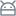 | `android` | `getIcon("android")` | `<Icon name="android" />` |
|  | `apple` | `getIcon("apple")` | `<Icon name="apple" />` |
|  | `arrow-bottom` | `getIcon("arrow-bottom")` | `<Icon name="arrow-bottom" />` |
| 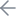 | `arrow-left` | `getIcon("arrow-left")` | `<Icon name="arrow-left" />` |
| 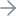 | `arrow-right` | `getIcon("arrow-right")` | `<Icon name="arrow-right" />` |
| 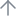 | `arrow-top` | `getIcon("arrow-top")` | `<Icon name="arrow-top" />` |
|  | `attention` | `getIcon("attention")` | `<Icon name="attention" />` |
|  | `bell` | `getIcon("bell")` | `<Icon name="bell" />` |
|  | `box` | `getIcon("box")` | `<Icon name="box" />` |
|  | `brush` | `getIcon("brush")` | `<Icon name="brush" />` |
|  | `calculator` | `getIcon("calculator")` | `<Icon name="calculator" />` |
| 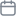 | `calendar` | `getIcon("calendar")` | `<Icon name="calendar" />` |
|  | `camera` | `getIcon("camera")` | `<Icon name="camera" />` |
|  | `cancel` | `getIcon("cancel")` | `<Icon name="cancel" />` |
|  | `carat-bottom` | `getIcon("carat-bottom")` | `<Icon name="carat-bottom" />` |
|  | `carat-left` | `getIcon("carat-left")` | `<Icon name="carat-left" />` |
|  | `carat-right` | `getIcon("carat-right")` | `<Icon name="carat-right" />` |
|  | `carat-top` | `getIcon("carat-top")` | `<Icon name="carat-top" />` |
|  | `check` | `getIcon("check")` | `<Icon name="check" />` |
|  | `circle` | `getIcon("circle")` | `<Icon name="circle" />` |
|  | `cloud` | `getIcon("cloud")` | `<Icon name="cloud" />` |
|  | `code` | `getIcon("code")` | `<Icon name="code" />` |
| 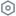 | `cog` | `getIcon("cog")` | `<Icon name="cog" />` |
|  | `collapse` | `getIcon("collapse")` | `<Icon name="collapse" />` |
|  | `contact` | `getIcon("contact")` | `<Icon name="contact" />` |
| 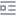 | `content` | `getIcon("content")` | `<Icon name="content" />` |
|  | `copy` | `getIcon("copy")` | `<Icon name="copy" />` |
|  | `desktop` | `getIcon("desktop")` | `<Icon name="desktop" />` |
|  | `discord` | `getIcon("discord")` | `<Icon name="discord" />` |
|  | `download` | `getIcon("download")` | `<Icon name="download" />` |
|  | `edit` | `getIcon("edit")` | `<Icon name="edit" />` |
|  | `expand` | `getIcon("expand")` | `<Icon name="expand" />` |
| 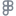 | `figma` | `getIcon("figma")` | `<Icon name="figma" />` |
|  | `file` | `getIcon("file")` | `<Icon name="file" />` |
|  | `filter` | `getIcon("filter")` | `<Icon name="filter" />` |
|  | `folder` | `getIcon("folder")` | `<Icon name="folder" />` |
| 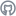 | `github` | `getIcon("github")` | `<Icon name="github" />` |
|  | `google` | `getIcon("google")` | `<Icon name="google" />` |
|  | `heart` | `getIcon("heart")` | `<Icon name="heart" />` |
|  | `home` | `getIcon("home")` | `<Icon name="home" />` |
|  | `image` | `getIcon("image")` | `<Icon name="image" />` |
|  | `laptop` | `getIcon("laptop")` | `<Icon name="laptop" />` |
| 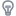 | `lightbulb` | `getIcon("lightbulb")` | `<Icon name="lightbulb" />` |
|  | `link` | `getIcon("link")` | `<Icon name="link" />` |
|  | `location` | `getIcon("location")` | `<Icon name="location" />` |
|  | `lock` | `getIcon("lock")` | `<Icon name="lock" />` |
|  | `mail` | `getIcon("mail")` | `<Icon name="mail" />` |
|  | `medium` | `getIcon("medium")` | `<Icon name="medium" />` |
| 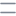 | `menu` | `getIcon("menu")` | `<Icon name="menu" />` |
|  | `message` | `getIcon("message")` | `<Icon name="message" />` |
| 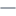 | `minus` | `getIcon("minus")` | `<Icon name="minus" />` |
|  | `moon` | `getIcon("moon")` | `<Icon name="moon" />` |
|  | `nice` | `getIcon("nice")` | `<Icon name="nice" />` |
|  | `npm` | `getIcon("npm")` | `<Icon name="npm" />` |
| 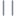 | `pause` | `getIcon("pause")` | `<Icon name="pause" />` |
|  | `phone` | `getIcon("phone")` | `<Icon name="phone" />` |
|  | `plus` | `getIcon("plus")` | `<Icon name="plus" />` |
|  | `profile` | `getIcon("profile")` | `<Icon name="profile" />` |
|  | `puzzle` | `getIcon("puzzle")` | `<Icon name="puzzle" />` |
|  | `python` | `getIcon("python")` | `<Icon name="python" />` |
|  | `react` | `getIcon("react")` | `<Icon name="react" />` |
|  | `search` | `getIcon("search")` | `<Icon name="search" />` |
|  | `shuffle` | `getIcon("shuffle")` | `<Icon name="shuffle" />` |
|  | `skip` | `getIcon("skip")` | `<Icon name="skip" />` |
|  | `spinner` | `getIcon("spinner")` | `<Icon name="spinner" />` |
|  | `star` | `getIcon("star")` | `<Icon name="star" />` |
| 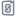 | `storybook` | `getIcon("storybook")` | `<Icon name="storybook" />` |
|  | `sun` | `getIcon("sun")` | `<Icon name="sun" />` |
|  | `tablet` | `getIcon("tablet")` | `<Icon name="tablet" />` |
|  | `trash` | `getIcon("trash")` | `<Icon name="trash" />` |
|  | `upload` | `getIcon("upload")` | `<Icon name="upload" />` |
|  | `x` | `getIcon("x")` | `<Icon name="x" />` |
|  | `youtube` | `getIcon("youtube")` | `<Icon name="youtube" />` |
| 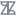 | `zendesk` | `getIcon("zendesk")` | `<Icon name="zendesk" />` |
